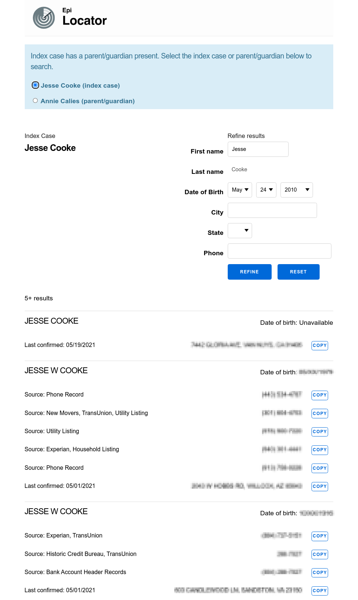

# Overview

In NYS, Epi Locator is deployed by its original name, CT Assist.

## Contact Tracer Workflow

As a contact tracer ("CT") works on cases in CommCare, they may find a patient case
is missing full and/or accurate contact information. From the Case Investigation
form, the CT can click the "Search CT Assist for phone and address" link which will
open Epi Locator in a new browser tab and perform a search against the Thomson Reuters ("TR")
[CLEAR S2S API](https://developerportal.thomsonreuters.com/clear-system-system). The CT
can then copy relevant contact information from Epi Locator into their clipboard, then
into CommCare. Epi Locator does not write data to CommCare.

<pre>
<code class="mermaid">
sequenceDiagram;
    CT->>+CommCare: Click button;
    CommCare->>CommCare: generate signature;
    CommCare->>Epi Locator: POST;
    alt signature in cache;
        Signature Cache-->>Epi Locator: used signature;
        Epi Locator-->>CT: access denied;
    else signature not in cache;
        alt signature invalid;
            Signature Cache-->>Epi Locator: invalid signature;
            Epi Locator-->>CT: access denied;
        else;
            Signature Cache-->>Epi Locator: valid signature;
            alt query in cache;
                Query Cache-->>Epi Locator: return results;
            else query not in cache;
                Epi Locator->>CLEAR S2S: initiate search;
                CLEAR S2S->>CLEAR S2S: perform search;
                CLEAR S2S-->>Epi Locator: search results;
                Epi Locator-->>CT: present results;
            end;
        end;
    end;
</code>
</pre>

## Integration with CommCare

Epi Locator authenticates with CommCare by verifying an HMAC signature that is passed
from CommCare to Epi Locator by a `form POST`. Please see the CommCare [source 
code](https://github.com/dimagi/commcare-hq/blob/74bc31910f692126f03c46a350ab8ae5700f87dd/corehq/apps/integration/static/integration/js/hmac_callout.js) 
for their implementation. Epi Locator mirrors this implementation locally for development purposes in the 
  [commcare_signature.html.eex](https://github.com/RatioPBC/epi-locator/blob/main/lib/epi_locator_web/templates/page/commcare_signature.html.eex) template.

The signature is verified in `EpiLocatorWeb.Plugs.RequireValidSignature` with `EpiLocator.Signature.valid?/3`. 
We store the signature in a cache in `EpiLocator.Signature.Cache` and reject any signatures that have
already been used.

If the signature is valid, Epi Locator performs a search through cache to the TR CLEAR S2S API.
Because TR charges per query, we store results from previous queries in our cache to
minimize costs. If a cache entry for a query doesn't already exist, we make an API request and store
the results.

## CLEAR S2S API Integration

In order to make requests against the CLEAR S2S API, one must ask TR to provision a certificate
that is used to sign HTTP requests to the API. They will send a `PFX` file, which will need the certificates 
extracted via the following command:

```
openssl pkcs12 -in input.pfx -out certificate.cer -nodes
```

The result file contains a key and 2 certificates. The first certificate in the cert chain will need all the newlines converted to literal `\n`
characters and made available to the application via environment variables:

```
THOMSON_REUTERS_BASIC_AUTH
THOMSON_REUTERS_CERT_PASSWORD
THOMSON_REUTERS_API_ENDPOINT
THOMSON_REUTERS_PRIVATE_KEY
THOMSON_REUTERS_PUBLIC_CERT
```

See `EpiLocator.ThomsonReuters.Config` for more details. Each time a query is made, a 
`EpiLocator.QueryResultLog` is stored with stats relevant to the query. These stats can be accessed
through the admin login, where one can download all entries or monthly summaries.

## Refining Search Results

CTs have the ability, when presented with multiple search results, to refine the results.



Each time the results are refined, a `EpiLocator.RefinementLog` is stored with stats relevant
to the specific refinement. These stats can be access through the admin login, where one can
download all entries or monthly summaries.

## Performance

75% of requests to the CLEAR S2S API are returned within 700-1000 ms.

```sql
WITH query_result_logs_stats AS (
    SELECT
        min(msec_elapsed) AS min,
        max(msec_elapsed) AS max,
        count(*) AS total_count
    FROM
        query_result_logs
    WHERE
        msec_elapsed BETWEEN 100 AND 2560
),
histogram AS (
    SELECT
        width_bucket(msec_elapsed, min, max, 49) AS bucket,
        int4range(min(msec_elapsed), max(msec_elapsed), '[]') AS RANGE,
        count(*) AS freq
    FROM
        query_result_logs,
        query_result_logs_stats
    WHERE
        msec_elapsed IS NOT NULL
        AND msec_elapsed != 0
        AND msec_elapsed BETWEEN 100 AND 2560
    GROUP BY
        bucket
    ORDER BY
        bucket
),
freeq AS (
    SELECT
        bucket,
        RANGE,
        freq,
        repeat('■', (freq::float / max(freq) OVER () * 100)::int) AS bar,
        freq::float / total_count * 100 AS pct
    FROM
        histogram,
        query_result_logs_stats
    GROUP BY
        bucket,
        RANGE,
        freq,
        pct
    ORDER BY
        bucket
)
SELECT
    *
FROM
    freeq
```

## Releases

Please see the [Release log](https://ratiopbc.slab.com/public/posts/3curdkow).
